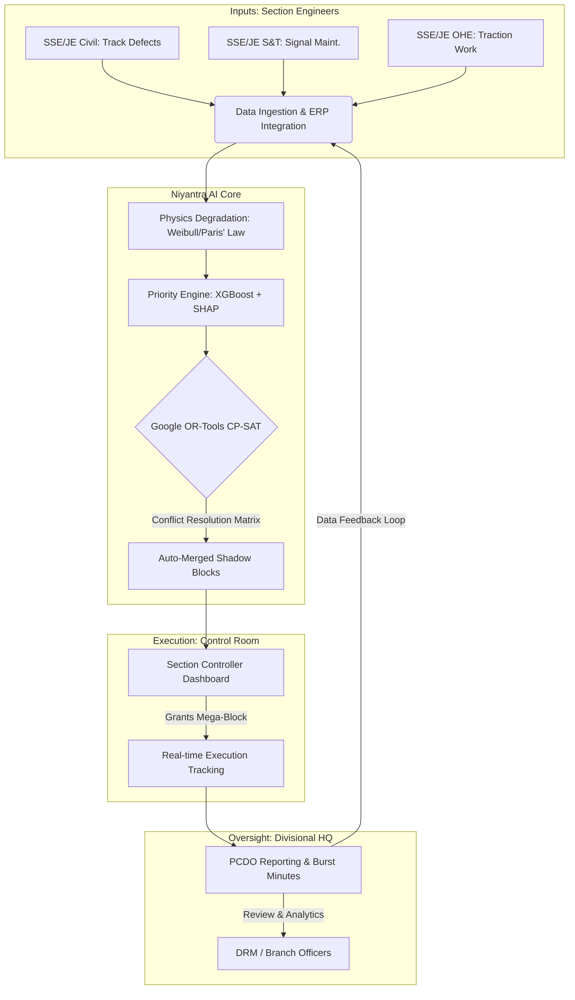

# ⚙️ Niyantra

**An AI-driven traffic block and inter-departmental schedule optimizer for Indian Railways.**

**Context:** Smart India Hackathon 2026 | **Problem Statement ID:** SIH26027 | **Theme:** Transportation & Logistics / Smart Automation | **Team:** Buzzards

> **Official Problem Statement:** 
> *"AI-based optimization of traffic block planning, capacity utilization, and inter-departmental conflict resolution for railway maintenance."*

---

## 🚨 The Problem

Indian Railways loses thousands of operational hours and significant line capacity annually due to uncoordinated, ad-hoc maintenance windows. Currently, track maintenance requests from different departments (Civil Engineering, Signal & Telecom, and Traction/OHE) operate in isolated silos, fighting for the same limited track time.

**The Current Broken Process:**
`Manual Block Request (Paper/Phone)` → `Siloed Department Planning (Civil vs. S&T vs. OHE)` → `Overlapping Corridor Clashes` → `Ad-Hoc Train Delays & Safety Backlogs`

**The Gap:** Section Controllers and Divisional HQ lack a **predictive, unified schedule-linking layer** capable of automatically resolving multi-department conflict and merging maintenance requests without disrupting the master train schedule.

---

## 💡 What Niyantra Does

**_Given limited track availability, how can multiple railway departments mathematically merge their maintenance blocks without delaying passenger and freight trains?_**

Niyantra digitizes and automates the informal weekly coordination process, replacing manual spreadsheet reconciliation with a mathematically optimized, conflict-free scheduling engine.

**The Improved Niyantra Process:**
`Live Defect/Request Logged` → `Algorithmic Priority Rescoring (Instant)` → `CP-SAT Shadow-Block Auto-Merging` → `Zero-Conflict Mega Blocks`

**The Output:** Niyantra continuously generates an "Impact Matrix" and a mathematically optimized weekly block plan. It automatically identifies "Shadow Blocks"—windows where Civil, S&T, and Electrical teams can piggyback on the same track possession—tracking "Burst Minutes" to calculate the exact punctuality impact of any maintenance delay.

---

## 🏗️ How It Works

1. **Input (Section Engineers):** Ground-level engineers (SSE/JE from Civil, S&T, and Traction) input track defects and maintenance requests via mobile or legacy systems (TMS).
2. **Niyantra AI Core:** The system applies material fatigue models (Paris' Law) to score severity, while Google OR-Tools (CP-SAT) evaluates section capacities to merge cross-departmental requests into unified "Shadow Blocks."
3. **Execution (Control Room):** Section Controllers view the algorithmic, conflict-free recommendations on a low-latency dashboard, allowing them to grant Mega-Blocks safely without disrupting master train schedules.
4. **Oversight (Divisional HQ):** Post-execution, the system tracks "Burst Minutes" (overtime) and automatically generates PCDO/RAMS reports for Branch Officers (Sr. DEN/DRM).


## 🔑 Why This Is Different

* **Cross-Department Synergy:** We don't just track maintenance; we auto-merge overlapping requests so multiple departments can work under a single track possession, drastically reducing asset downtime.
* **Physics-Informed Triggers:** Uses crack-growth fatigue logic to prioritize track repairs based on physical reality and RRSK safety requirements, not just basic FIFO (First-In-First-Out) scheduling.
* **Smart Overlay Architecture:** Built to integrate with legacy CRIS systems without requiring an entire database replacement.
* **Explainable AI (XAI):** High-stakes railway operations require trust. Our models utilize SHAP values to provide Sr. DEN/DSTE/DEE officers with clear "Why Scheduled Here?" reasoning for every algorithmic block decision.

---

## 🧰 Tech Stack

| Layer | Technology |
| :--- | :--- |
| **Frontend** | React 18, Tailwind CSS, Recharts, Framer Motion |
| **Backend** | FastAPI (Python), SQLAlchemy |
| **AI / Mathematical Engine** | XGBoost, SHAP, Custom Physics Rules (Paris' Law) |
| **Optimization Solver** | Google OR-Tools (CP-SAT) |
| **Database** | PostgreSQL, PostGIS (Spatial routing), Supabase |
| **Authentication** | bcrypt, JWT, Email OTP 2FA |
| **Deployment** | Vercel (Edge UI), Render (Containerized Backend) |

---

## ✅ Feasibility

We deliberately designed Niyantra as a **"Smart Overlay"** that can integrate directly with existing CRIS/ERP systems via APIs, rather than requiring Indian Railways to abandon its current infrastructure.

| Challenge | Mitigation |
| :--- | :--- |
| **CRIS Data Integration** | Niyantra uses an API overlay architecture, designed to pull static data from disparate systems (TMS, SMMS) into a unified PostgreSQL schema. |
| **Safety & Compliance Limits** | "Human-in-the-Loop" design ensures the CP-SAT optimizer acts strictly as a recommendation engine; Section Controllers retain final execution approval. |
| **Algorithmic Opacity** | Embedded Explainable AI (SHAP) guarantees that every schedule output comes with plain-text reasoning for railway supervisors. |
| **Phased Rollout** | Cloud-native microservices architecture allows deployment to start on a single division/corridor before scaling Zonal or Railway-wide. |

---

## 📈 Potential Impact

Based on standard railway optimization metrics, implementing this schedule-linking layer targets:
* **30%** reduction in safety risks by accelerating resolution of deferred critical defects.
* **25%** increase in operational efficiency through automated weekly block planning.
* **20%** direct economic savings by minimizing line capacity losses via merged blocks.
* **15%** improvement in train punctuality and freight reliability by reducing ad-hoc disruptions.

---

## 📦 Product Status

Niyantra is currently an active working prototype in functional development. While the core FastAPI backend, Google OR-Tools (CP-SAT) optimization engine, and React frontend dashboard are integrated and communicating in real-time on live cloud environments, the system is actively being refined. 

Current development priorities include:
* **Model Optimization:** Further tuning and refining the predictive AI and physics-informed material fatigue models (Paris' Law / Weibull) for improved operational accuracy.
* **Dataset Enrichment:** Ingesting and evaluating richer, more comprehensive domain datasets to stress-test constraint solving across complex multi-corridor scenarios.
* **UI/UX Polish:** Implementing minor UI tweaks and dashboard enhancements to improve usability for infrastructure controllers and operations managers.
  
## 🚀 Getting Started

*(Ensure you have Python 3.10+ and Node.js 18+ installed)*

```bash
# Clone the repository
git clone [https://github.com/cyber-Anki/Niyantra.git](https://github.com/cyber-Anki/Niyantra.git)
cd Niyantra

# --- 1. Backend Setup ---
cd backend
python -m venv venv
source venv/bin/activate  # On Windows: venv\Scripts\activate
pip install -r requirements.txt
# Create a .env file with your Supabase DB URI
uvicorn main:app --reload

# --- 2. Frontend Setup ---
# Open a new terminal window
cd ../frontend
npm install
npm run dev
```
## 📚 References

* Indian Railways Civil Engineering Portal (IRCEP)
* Centre for Railway Information Systems (CRIS) Documentation
* Rashtriya Rail Sanraksha Kosh (RRSK) Safety Mandates
* Google OR-Tools CP-SAT Documentation (`developers.google.com`)
* Published Operations Research (OR) literature on railway corridor maintenance-window optimization.

---
*Built for the Smart India Hackathon 2026 (SIH26027).*
